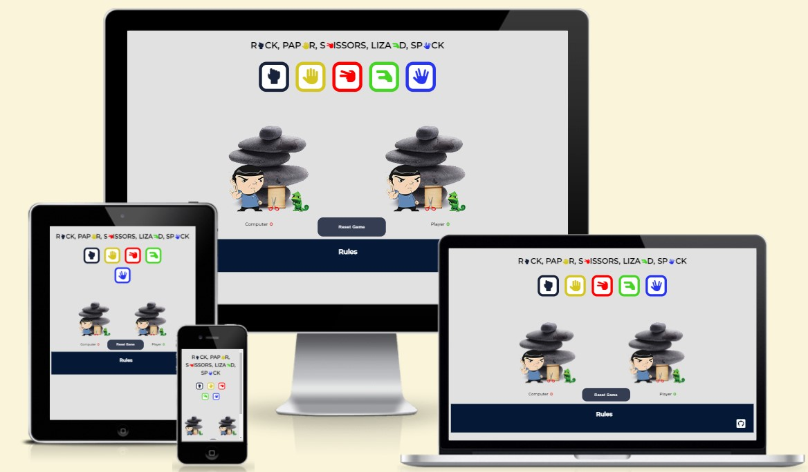
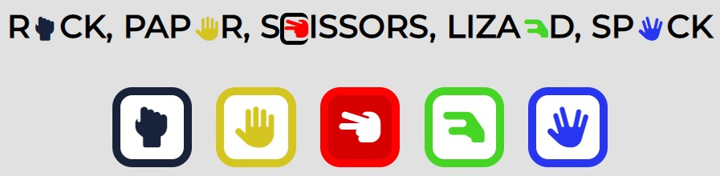
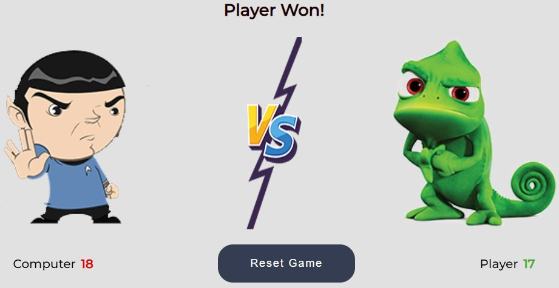

---

An interactive Rock, Paper, Scissors, Lizard, Spock game that allows users to play the famous game against the computer without being able to easily predict the outcome.

It is an exciting and interactive game that people can play on their own. It will be interesting for adults and children. With the help of this game, you can pass the time with fun for those who are on a long journey or in the waiting room.

# FEATURES
* HEADER
    - Featured at the top of the page, the header shows the game name: Rock, Paper, Scissors, Lizard, Spock in a font that is playful and clearly contrasts with the background.
    - This header clearly lells the user what game they are playing.

        

* THE GAME OPTIONS
    - This section includes five buttons that the user can press and play against the computer.
    - The buttons have no names, but have clear icons that make it clear what each button is for.
    - The icons are also duplicated in the theader of the game in the middle of each word for a better understanding of the destination of each button.
    - When user move the mouse cursor over one of these buttons, the color of the button changes. Also, a line appears in the header that circles the icon and looks like the letter. That allows the user to better orient himself in the purpose of the buttons.

        

* THE GAME RESULTS
    - When the user presses one of the five game buttons, the image of his choice immediately appears.
    - The JavaScript code selects a random variant of the computer and displays the corresponding image.
    - The winner is announced to the user under the game selection buttons, and the score is updated either for the user or for the computer, depending on who won.
    - It is also possible for the user to reset the results of the game by pressing the Reset Game button and start the game again.

        

* THE FOOTER
    - In the footer section is the Rules header and an icon from the link to my Github repository.
    - When clicking on the Rules heading, a pop-up window opens in which the rules of the game are described.
    - The user can close the pop-up window by clicking on the "x" icon or by clicking anywhere outside the window.

        

