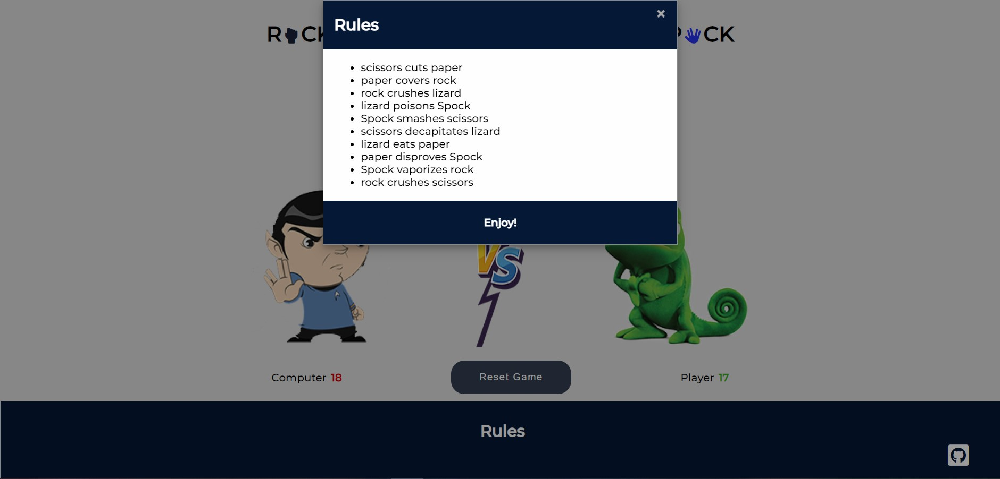

---

An interactive Rock, Paper, Scissors, Lizard, Spock game that allows users to play the famous game against the computer without being able to easily predict the outcome.

It is an exciting and interactive game that people can play on their own. It will be interesting for adults and children. With the help of this game, you can pass the time with fun for those who are on a long journey or in the waiting room.

## FEATURES
---
* HEADER
    - Featured at the top of the page, the header shows the game name: Rock, Paper, Scissors, Lizard, Spock in a font that is playful and clearly contrasts with the background.
    - This header clearly lells the user what game they are playing.

        

* THE GAME OPTIONS
    - This section includes five buttons that the user can press and play against the computer.
    - The buttons have no names, but have clear icons that make it clear what each button is for.
    - The icons are also duplicated in the theader of the game in the middle of each word for a better understanding of the destination of each button.
    - When user move the mouse cursor over one of these buttons, the color of the button changes. Also, a line appears in the header that circles the icon and looks like the letter. That allows the user to better orient himself in the purpose of the buttons.

        

* THE GAME RESULTS
    - When the user presses one of the five game buttons, the image of his choice immediately appears.
    - The JavaScript code selects a random variant of the computer and displays the corresponding image.
    - The winner is announced to the user under the game selection buttons, and the score is updated either for the user or for the computer, depending on who won.
    - It is also possible for the user to reset the results of the game by pressing the Reset Game button and start the game again.

        

* THE FOOTER
    - In the footer section is the Rules header and an icon from the link to my Github repository.
    - When clicking on the Rules heading, a pop-up window opens in which the rules of the game are described.
    - The user can close the pop-up window by clicking on the "x" icon or by clicking anywhere outside the window.

        

## Testing
---
* I tested that this page works in different browsers: Chrome, Firefox, Opera.
* I confirmed that this project is responsive, looks good and functions on all standard screen sizes using the
    devtools device toolbar.
* I confirmed that the game results are always correct.
* I confirmed that the header, buttons and rules of game are all readable and easy to understand.
* I confirmed that the colors and fonts chosen are easy to read and accessible by running it through lighthouse in devtools.

    

## Bugs
---
* Unresolved bug
    - If I had a little more time, I would have fixed the errors in some of the commits. I researched this problem and found that when  work in Gitpod for a long time, when writing a commit, letters are displayed with a delay. Solution of the problem - reloading the page.
    - When the page is displayed in the browser with dark or night mode, then a gray rectangle becomes visible between the two opponents, and if it is removed, the html checker gives an error. JavaScript also uses this tag to display a vs.png image.
        

    - This can be solved by rendering a vs.png image that uses JavaScript as a background using CSS.

## Validator Testing
---
* HTML
    - No errors were returned when passing through the official W3C validator.
        
* CSS 
    - No errors were returned when passing through the official W3C validator.
        
* JavaScript
    - No errors were returned when passing through the JShint
 validator, but there are two warnings about sematics. I was trying to generate code without variables in the global scope.
        
 

 ## Deployment
---
 * The site was deployed to GitHub pages. The steps to deploy are as follows:

    - In the GitHub repository, navigate to the Settings tab

    - From the left, in the Code and automation section, select Page

    - From the source section drop-down menu, select the Master Branch

    - Once the master branch has been selected, the page provided the link to the completed website.

The live link can be found here - [Rock, Paper, Scissors, Lizard, Spock](https://satogako.github.io/Rock-Paper-Scissors-Lizard-Spock-/)

## Credits
---
#### Content

* The animation code and popup listeners were taken from YouTube tutorials.
* The setTimeout() method in JavaScript was taken from the site [w3schools](https://www.w3schools.com/jsreF/met_win_settimeout.asp).

#### Media

* The images was taken from [pngwing.com](https://www.pngwing.com/).

